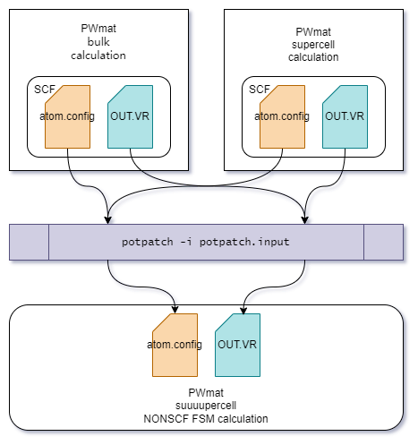

# PotPatch
This is an implementation of the potentail patching, which is a semiconductor shallow impurity level calculation method, in PWmat. 


## Installation (with `pip`)
### Directly via the network (the machine has access to Github)
```bash
pip3 install git+https://github.com/bzzlfd/potpatch.git

# try it out 
potpatch --version
```

or specify a branch to get the latest (in-development) features, e.g. 
```bash
pip3 install git+https://github.com/bzzlfd/potpatch.git@im_pos
```

### Download and install (the network is accessible except for GitHub)
download the `potpatch` project to your local machine, and execute the following command:
```bash
pip3 install <local potpatch project path>

# try it out 
potpatch --version
```

### For development
```bash
pip3 install -e <local potpatch project path>
```

### Some suggestions on offline machine installation
the *dependencies* of `potpatch` are `numpy` and `numba`, the *build dependencies* of `potpatch` project are `setuptools>=61.0.0` and `wheel`

there are some suggestions:
1. [Anaconda](https://www.anaconda.com/) contains all *dependencies* what `potpatch` needs. consider installing it
   1. `pip install .` will install *build dependencies* from internet anyway (I don't know why), so even if you have installed Anaconda, you still need to `pip download` the *build dependencies*. 
2. `pip download`
   1. Execute `pip3 download numpy numba setuptools wheel -d <path1>` on a machine connected to internet. This commend will download required package `*.whl` wheel files to the `<path1>` which you specify.
   2. Upload package files to the offline machine in `<path2>`. 
   3. Execute `pip3 install . --no-index --find-links=<path2>` instead. 
3. about suggestion 1.1, there are alternative methods
   1. a copy of *build dependency* wheel files was downloaded to `deprecated/` path in advance. Execute `pip3 install . --no-index --find-links=deprecated/` instead directly. 
   2. using deprecated `python3 setup.py`. `mv ./pyproject.toml deprecated/` and `cp deprecated/setup* ./`, then execute `python3 setup.py install` (or `python3 setup.py develop` for development). 
4. about suggestion 2
   1. I'm concerned that this installation method might encounter platform issues, but the advantage of this method is that you don't need to download an entire Anaconda.
   2. The fortunate thing is, these *build dependencies* are compatible with all platforms. 
5. Additionally, there are some unorthodox methods.
   1. modify `PYTHONPATH` environment variable or copy this code into a directory where Python knows ([`python3 -m site`](https://docs.python.org/3/library/site.html) will provide you with some information.).
   2. These are some hacks for Python import mechanisms. This way, you can use this program through `python3 -m potpatch`. 


## Usage
The role played by this program is shown in the diagram below.


[Here](doc/tutorial.md) is a tutorial that walks you through an example, explaining the calculation process and considerations.
This tutorial focuses on the usage of the program. If you feel confused while reading, you can refer to [References](#references) for understanding what we are doing.


## Contribution
This code is in Alpha version. 
Bug reports, more natural usage recommends, unambiguous statements, tests, improvements ... are all welcome. 

> Please feel free to get in touch. -> (zzkai@csrc.ac.cn) 
> 私信辱骂/帮他抗压/让他爽到 -> (zzkai@csrc.ac.cn) 

`doc/` also have some notes to help understand the program.


## References

potential patching

1. [Wang L W. Density functional calculations of shallow acceptor levels in Si[J]. Journal of Applied Physics, 2009, 105(12).](https://doi.org/10.1063/1.3153981)
2. [Zhang G, Canning A, Grønbech-Jensen N, et al. Shallow impurity level calculations in semiconductors using ab initio methods[J]. Physical review letters, 2013, 110(16): 166404.](https://doi.org/10.1103/PhysRevLett.110.166404)
3. [Kang J, Wang L W. First-Principles Calculations of Shallow Acceptor-Carbon Complexes in Si: A Potential-Patching Method with a Hybrid-Functional Correction[J]. Physical Review Applied, 2022, 18(6): 064001.](https://doi.org/10.1103/PhysRevApplied.18.064001)

folded spectrum method (FSM)

1. [Wang L W, Zunger A. Solving Schrödinger’s equation around a desired energy: Application to silicon quantum dots[J]. The Journal of Chemical Physics, 1994, 100(3): 2394-2397.](https://doi.org/10.1063/1.466486)

##

这真的是一个 python project, 信我啊
